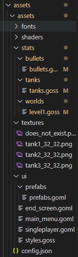
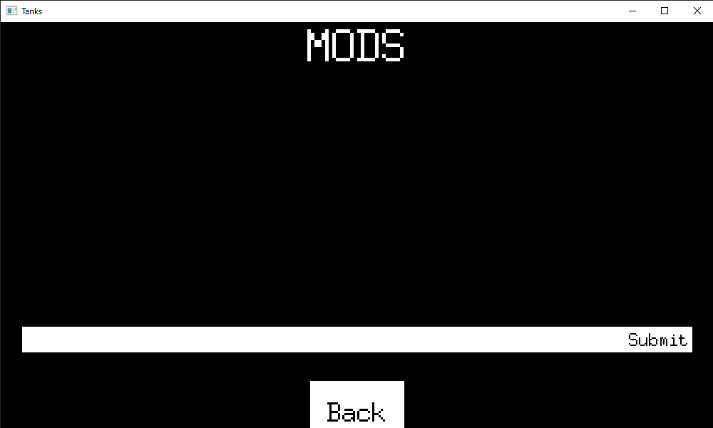

# go-tanks

For now this is just one super annoying game where computer proves you that you don`t know how to play. Its actually made for community to build. All levels and tanks already in game are made by builtin modding language, that can be utilized by anyone to make your own game and rules. 

## installation

You can install Go and build your own up to date version or, match simpler, just download [latest release](https://github.com/jakubDoka/go-tanks/releases/tag/0.0.2).

## ambitions

I don't have too big expectations as game is really small and simple. It can get interesting though, when multiplayer will be added. Yes if AI (just an if statements) in game is too strong, its always good to have option to bust some real players. Making an online game is complex though. I can only invest by time into it if there is someone who can enjoy the product. (need a good mood to code as well)

Most important though, are your ideas. I am a coder (or at least i think so), but am really bad at creating content. Thats also why all content in game is created by mods. I need ideas and goals to be productive! Best way to make your idea real, is to share them with me, and believe me, almost everything is possible (except 3D, I am not doing that).

## modding

Now that we gone over some boring stuff, lets make it even worse. I will now briefly go over all modding capability that is offered for you as a user.



---

On the left you can see the folder structure your mod should have. Here you can beautifully what can be defined. If game grows, this will get more complex. For example i already have particle framework ready, though i have to make a modding support for it to be added to game. 

`ui` folder is an interesting place. The engine that this game is made in has its own ui language and all scenes that are in game are written in it. you can copy and modify scenes, then load them in mod and arrange your ui. This feature though is not user friendly as with malfunction in ui you cannot see the errors.

`textures` you can include textures and `_32_32` at the end defines side of one frame in sprite sheet. You can of course include frames separately (as they get packed in one big texture anyway), but this keeps it cleaner.

`shaders` and `fonts` are coming soon.

Later you will notice that name of each texture matches the tank name, this is not necessary, but this way you don't need to specify texture regions in tank definition.

---

### goss

You can inspect the contents of files, there are some quick links to them: [tanks.goss](https://github.com/jakubDoka/go-tanks/blob/main/game/assets/assets/stats/tanks/tanks.goss), [level1.goss](https://github.com/jakubDoka/go-tanks/blob/main/game/assets/assets/stats/levels/level1.goss), [bullets.goss](https://github.com/jakubDoka/go-tanks/blob/main/game/assets/assets/stats/bullets/bullets.goss)

I think that syntax of goss is obvious to you. Take away is that you can list values by just writing them separated by spaces. Now theres a section that will list all properties you can specify in each definition:

```goss
    default_bullet{
        speed: 500;
        size: 5;
        livetime: 1;
        damage: 1;
        sprite: tank_name3;
    }
```

`tank_name3` is generated by loader based of witch tank is using the bullet. Multiple tanks can have same bullet.

```goss
    default_tank{
        bullet: default_bullet;
        
        speed: 2000;
        transmission: .5;
        steer_speed: 3;
        base_sprite: tank_name2;
        
        max_health: 50;
        size: 20;
        
        regeneration_proc: 10;
        regeneration_tick: 1;
        regeneration_power: 1;

        next: nothing;
        needed_score: 10;
        value: 1;

        distancing: .5;
        retreat_ratio: 5;
        memory: .5;
        
        
        turret_speed: 3;
        reload_speed: 1;
        turret_len: 50;
        turret_sprite: tank_name1;
        turret_pivot: -7 0;
        turret_offset: -7 0;
    }
```

Now thats a lot of stuff isn't it. And there can be even more ef we want multiple turrets of particle effects. Lets explain some less clear fields. 

`regeneration_proc` is time in seconds that has to pass for tank to start regenerate. Timer restarts if tank gets hit again.

Into `next` you can place a next tank player will get if he reaches `needed score` by receiving `value` for each kill.

`distancing`, `retreat_ration` and `memory` affect the AI if tank. Its not relevant for player, but shortly, higher the retreat ratio is, more aggressive the tank is. Sniper prefers higher distancing then shotgun (yet to be implemented). If you make memory too big, tank will never stops chasing you once he spots you (unless he retreats).

Last set of properties tackle the look of turret and its strength.

```goss
default_level{
    size: 5000 5000;
    Tile: 250 250;
    scale: 1.5 1.5;
    background_color: 0 0 0 0;

    friction: 10;

    spawn_rate: 60;
    team_count: 2;
    spawns: nothing...;
    player: nothing;
    win_message: YOU WON;
    lose_message: YOU LOST;
    disabled_enemy: nothing...;
    disabled_player: nothing...;
}
```

For now there is not match you can do with a world, but obstacles will be added (AI will have to navigate trough it (that will be hell)), decorations and spawn points (whatever you think is appropriate). 

When there are three dost after the definition, you can specify variable amount of values. For example `spawns` can be fed with names of tanks you defined. Witch tank will spawn will be randomly chosen. `player` is necessary for level to be playable (name of defined tank). 

If you have a complex leveling snake but don't want to use it in simpler map, you can mention tank name in `disabled_enemy` property.

### loading

Now that we know wha we can customize, how do we load the mod? Well for now you should just provide a mod path in mod loader scene. When you started a game, you can click `Mods` option. It will look something lke this:



Click a white bar and start typing the path to your mod. You can for convenience put mod in the game directory and use relative path. Copy/paste can be used. Game can complain, but if you enter existing path, mod should appear with option to remove it. At this point you have to reboot the game. 

After rebooting, your home screen will probably change, new button called `Errors` can appear. Game lists all issues with your mod under this button, if they are marked as `[note]` you can ignore them, otherwise if they are marked with `[error]` you have to fix them or you cannot play.
